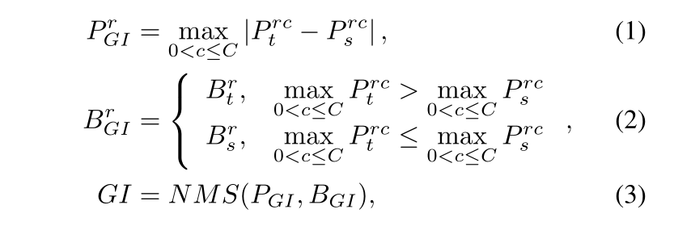
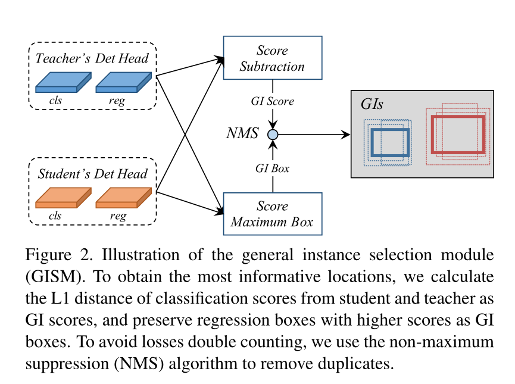
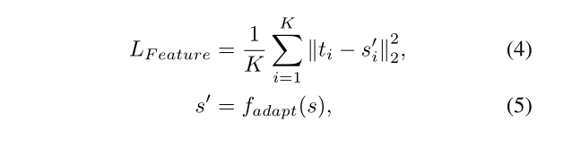
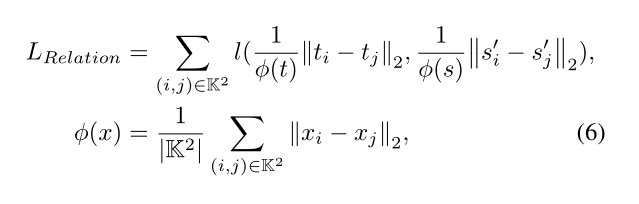
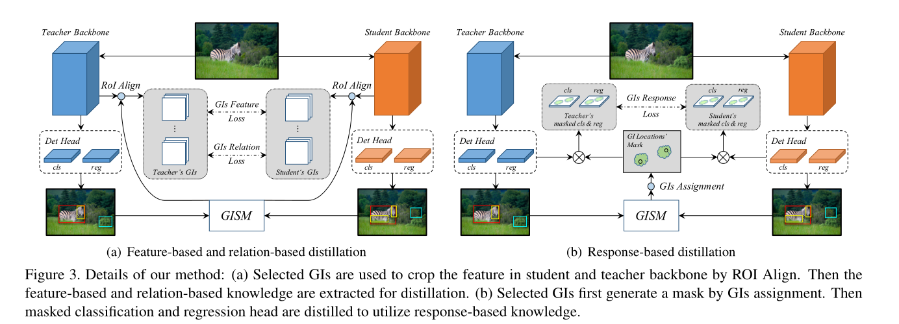
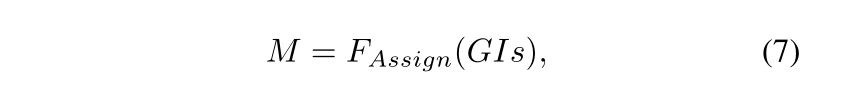
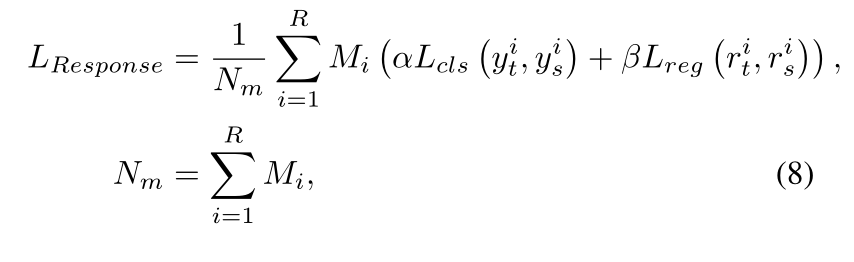
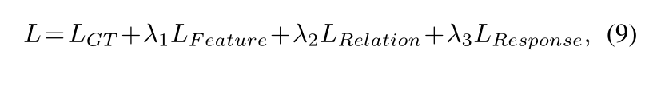

Thus, we propose a novel distillation method for detection tasks based on discriminative instances without considering the positive or negative distinguished by GT, which is called general instance distillation (GID).

Our approach contains a general instance selection module (GISM) to make full use
of feature-based, relation-based and response-based knowledge for distillation.

we propose a distillation method based on discriminative instances, utilizing response-based knowledge, feature-based knowledge as well as relationbased knowledge

之前的知识蒸馏认为，目标附近的特征块包含很多的信息，可以用于知识蒸馏，**但是我们发现，不只是目标附近的特征块，背景的特征块同样具有非常有意义的知识**，基于这个发现，我们 **提出了一个通用的实例的选择模型（GISM）** ，该模型利用teacher和student模型的预测结果来选择关键的实例来进行知识蒸馏。
### General Instance Selection Module
在检测模型中，注意的模块通常都是有意义的，teacher和student模块预测结果不一样的更能能体现出二者的差异，为了量化每一个实例并且选择出有区分的实例进行蒸馏，我们提出了两个名词： GI score和GI box，并且在每步训练中，动态的计算这两个量。为了训练时节省计算机资源，我们简单的计算分类分数的L1范数作为GI score 并且选择分数高的box作为GI box。图2解释了GI生成过程，并且每个预测实例的core和box的r的定义如下：  

  
同时，为了减少冗余计算，采用标准的非极大抑制对选择区域进行去重，从高到低，选择较高的GI score的块，然后较低的删除，选择IoU为0.3来过滤无用区域，此外，还提出每个实例最多取前K个。  

  
此外，为了更好利用teacher提供的信息，我们特区并充分利用feature-based relation-based response-based 来进行蒸馏，并且结果显示我们的蒸馏模型对于当前的检测模型普遍适用。

###  Feature-based Distillation
先进的检测模型都引进了FPN（特征金字塔），这可以提高多维度检测的鲁棒性。因为，FPN将特征和多层的 backbone，我们直觉的也选择了FPN来蒸馏（就是大家都用我也用）。跟别人不一样的是，我们根据GI box的大小从匹配的FPN层裁剪特征块。  
由于检测任务的目标的尺寸多变，直接执行像素级的蒸馏绘制的模型更倾向于大目标的学习。因此采用了ROIAlign算法，对GI 特征做了一个resize，统一尺寸，feature-based蒸馏损失如下：  

  

### Relation-based Distillation
分类任务中，不同目标间的关系在蒸馏中有至关重要的作用。但是这个方式还没人开发过。我们认为，同一场景中的目标有高度的相关性，不管前景还是背景，这些相关信息都能帮助学生网络更有效的收敛。得益于我们tongguo GISM选择的信息GI，我们可以充分利用实例之间的关系。对于一对一的特征蒸馏没什么重要的知识了，因为为了挖掘一批GI之间的关系，我们提出了relation-based的知识蒸馏。我们采用实例之间的欧氏距离衡量他们的关系，并且L1范式来转移知识。我们采用GIs的知识对teacher和student进行蒸馏，损失函数：  

  
### Response-based Distillation  
**proposes that the performance gain from the knowledge distillation mainly due to the regularization of the respond-based knowledge from the teacher model.**  
蒸馏的好坏，取决于teacher模型里边基于Response的知识的正则化。然而，如果使用所有的teacher检测头的所有输出进行蒸馏，对student模型是有害的。我们推测，这个可能是由于检测任务中正负样本的不平衡以及负样本太多以至于引入了噪声导致的。最近的一些检测蒸馏方法仅仅对于正样本进行了蒸馏，直接忽略了负样本正则化的影响。因此，我们设计基于选择的GIs的分类分支和回归分支的蒸馏 mask，比只是用GT标签的蒸馏mask更有效。  
由于不同模型的输出头不一样，我们提出了一个通用的框架，在不同模型上进行蒸馏。如图3b  

  
首先，基于GIs的蒸馏mask总结如下：  

然后基于响应的损失函数如下：  

    
### Overall loss function
端到端训练student模型，总的损失函数如下：  

 
