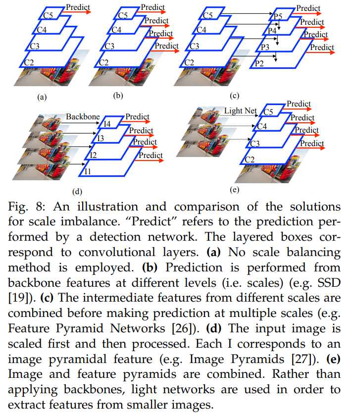

## Imbalance Problems in Object Detection: A Review  
### 1 INTRODUCTION  
在本文中，我们回顾了深度学习时代的目标检测文献，并确定了八个不同的不平衡问题。我们将这些问题分类为四种主要类型： class imbalance, scale imbalance, spatial imbalance and objective imbalance 

 
阅读指南如下:

* 第2节简要介绍了目标检测的背景，以及本文中经常使用的术语和符号列表
* 第3节介绍了我们对不平衡问题的分类
* 第4-7节详细介绍了每个不平衡问题，对提议的解决方案进行了批判性审查，并包括每个不平衡问题的未决问题。每一节专门讨论一个特定的不平衡问题，其设计都是可读的，包含了一些定义，并对所提出的方法进行了审查
* 第8节讨论了与所有不平衡问题相关的未决问题  
* 第9节总结了本文。为了提供更全面的视角，我们在补充材料中提出了解决其他但密切相关领域失衡的解决方案。

### 2 BACKGROUND, DEFINITIONS AND NOTATION
#### 2.1 State of the Art in Object Detection
如今，有两种主要的目标检测方法：自顶向下和自下而上。如今大多数的物体检测方法都遵循自上而下的方法；自底向上的方法是最近才提出的。自上而下和自下而上方法之间的主要区别在于，在自上而下的方法中，整体对象假设（即锚、兴趣区域\/建议）在检测管道的早期生成和评估，而在自下而上的方法中，整体对象通过分组子对象实体（如关键点或零件）出现，然后在处理管道中出现。 
遵循*自上而下*方法的方法分为两个阶段： two-stage and one-stage
* two-stage方法旨在通过使用*建议*机制将预定义的密集滑动窗口（称为锚）产生的大量负面示例减少到可管理的规模，该机制确定对象最有可能出现的区域，称为*感兴趣区域*（ROI）这些ROI由检测网络进一步处理，检测网络以bbox和关联对象类别概率的形式输出对象检测结果。最后，将非最大值抑制（NMS）方法应用于目标检测结果，以消除重复或高度重叠的结果。NMS是所有最先进的物体探测器使用的通用后处理步骤。
* 单阶段自上而下方法，包括SSD变体、YOLO变体和RetinaNet，旨在从输入图像提取特征后，*直接从锚预测检测结果*，而无需任何建议消除阶段。在图1（a）中展示了一个典型的单级目标检测管道。管道首先将输入图像送入特征提取网络，该网络通常是一个深度卷积神经网络。生成一组密集的对象假设（称为锚），然后通过将它们与地面真相框匹配来对其进行采样和标记。最后，标记锚（其特征从特征提取网络的输出中获得）被馈送到分类和回归网络进行训练。

另一方面*自底向上*的对象检测方法首先预测对象上的重要关键点（如坐标、中心等），然后使用组合方法（associative embedding and brute force search）将其分组，形成整个对象实例。 
#### 2.2 Frequently Used Terms and Notation
下表显示了整篇论文中使用的符号，下面是常用术语列表。

**Feature Extraction Network/Backbone**: This is the part of the object detection pipeline from the input image until the detection network.
**Classification Network/Classifier**: This is the part of the object detection pipeline from the features extracted by the backbone to the classification result, which is indicated by a confidence score.
**Regression Network/Regressor**: This is the part of the object detection pipeline from the features extracted by the backbone to the regression output, which is indicated by
two bounding box coordinates each of which consisting of an x-axis and y-axis values.
**Detection Network/Detector**: It is the part of the object detection pipeline including both classifier and regressor.
**Region Proposal Network (RPN)**: It is the part of the two stage object detection pipeline from the features extracted by the backbone to the generated proposals, which also have confidence scores and bounding box coordinates.
**Bounding Box**: A rectangle on the image limiting certain features. Formally, [x1, y1, x2, y2] determine a bounding box with top-left corner (x1, y1) and bottom-right corner (x2, y2) satisfying x2 > x1 and y2 > y1.
**Anchor**: The set of pre defined bounding boxes on which the RPN in two stage object detectors and detection network in one stage detectors are applied.
**Region of Interest (RoI)/Proposal**: The set of bounding boxes generated by a proposal mechanism such as RPN on which the detection network is applied on two state object
detectors.
**Input Bounding Box**: Sampled anchor or RoI the detection network or RPN is trained with.
**Ground Trut**h: It is tuple (B, u) such that B is the bounding box and u is the class label where u ∈ C and C is the enumeration of the classes in the dataset.
**Detection**: It is a tuple (B¯, p  ) such that B¯ is the bounding box and p is the vector over the confidence scores for each class2 and bounding box.
**Intersection Over Union**: For a ground truth box B and a detection box B¯, we can formally define Intersection over Union(IoU) [51], [52], denoted by IoU(B, B¯), as IoU(B, B¯) = A(B ∩ B¯) / A(B ∪ B¯), such that A(B) is the area of a bounding box B.
**Under-represented Class**: The class which has less samples in a dataset or mini batch during training in the context of class imbalance.
**Over-represented Class**: The class which has more samples in a dataset or mini batch during training in the context of class imbalance.
**Backbone Features**: The set of features obtained during the application of the backbone network.
**Pyramidal Features/Feature Pyramid**: The set of features obtained by applying some transformations to the backbone features.
**Regression Objective Input**: Some methods make predictions in the log domain by applying some transformation which can also differ from method to method (comparetransformation in Fast R-CNN and in KL loss forSmooth L1 Loss), while some methods directly predict thebounding box coordinates [23]. For the sake of clarity, weuse xˆ to denote the regression loss input for any method.
### 3 A TAXONOMY OF THE IMBALANCE PROBLEMS AND THEIR SOLUTIONS IN OBJECT DETECTION
在图2中，我们展示了相同的分类法，以及针对每个问题提出的解决方案列表。

 
**Class imbalance**当某个类被过度表示时，就会出现类不平衡（图2中的蓝色分支）。这个问题可能表现为“前景-背景不平衡”，即背景实例的数量明显超过正面实例；或者“前景-前景不平衡”，其中通常只有一小部分类对数据集进行了dom处理（如图5中的长尾分布所示）。类不平衡通常在对象检测管道中的“sampling”阶段处理（图1） 
**Scale imbalance**当对象实例具有不同的比例以及与不同比例相关的示例数量不同时，可以观察到比例不平衡（第5节；图2中的绿色分支）。这个问题是物体在自然界中具有不同维度这一事实的自然结果。规模也可能导致功能级别的不平衡（通常在图1中的“*feature extraction*”阶段处理），不同抽象层（ high and low levels）的贡献不平衡。尺度不平衡问题表明，单一尺度的视觉处理不足以检测不同尺度的物体。然而，正如我们将在第5节中看到的，所提出的方法在解决规模不平衡方面存在不足，尤其是对于小对象，即使数据集中的小对象数量惊人。 
**Spatial imbalance**（第6节；图2中的橙色分支）指的是一组与边界框的空间属性相关的因素。由于这些空间特性，我们确定了空间不平衡的三个子类型：（i）"imbalance in regression loss"是关于个别例子对回归损失的贡献，自然这个问题与损失函数的设计有关（ii）“IoU分布不平衡”与IoU分布中的偏差有关（among ground-truth boxes vs. anchors or detected boxes），通常在目标检测管道的边界框匹配和标记阶段观察到（图1）（iii）“object location imbalance”是关于图像中目标实例的位置分布，这与锚的设计和训练检测网络的采样子集有关。 
**objective imbalance**(第7节，图2中的紫色分支)出现在有多个目标(损失函数)要最小化的时候(每个目标都针对一个特定的任务，例如classification and box-regression) 由于不同的目标在其范围和最佳解决办法方面可能是不相容的，因此必须制订一项平衡的战略，以便找到对所有目标都可接受的解决办法。 
### 4 IMBALANCE 1: CLASS IMBALANCE
当一个类的代表过多，即数据集中的示例比其他类多时，就会观察到类失衡。从对象检测的角度来看，这可以以两种不同的方式发生:前景-背景不平衡和前景-前景不平衡。这两种类型的阶级失衡具有不同的特点，并且使用了不同类型的解决方案。因此，在下文中，我们将分别介绍它们。然而，一些解决方案(e.g. generative modeling)可以用于这两种问题类型 

#### 4.1 Foreground-Background Class Imbalance
*Definition*在前台-后台类不平衡中，过度代表的类和不足代表的类分别是ground和前台类。
这种类型的问题是不可避免的，因为大多数边界框都被边界框匹配和标记模块标记为背景类(即负类)，如图4(a)所示。
前景背景不平衡问题发生在训练过程中，它不依赖于数据集中每个类的示例数量，因为它们不包括任何背景注释。 
*Solutions*我们可以将前景-背景类失衡的解决方案分为四种:(i)硬采样方法，(ii)软采样方法，(iii)无采样方法和(iv)生成方法。每一组方法将在下面的小节中详细解释。在采样方法中，包围盒(BBi)对损失函数的贡献wi调整如下:

**wiCE(ps)**

其中CE()为交叉熵损失。硬法和软法在wi的可能值上是不同的。对于硬采样方法，wi∈{0,1}，则一个BB要么被选中，要么被丢弃。对于软采样方法，wi∈[0,1]，即样本的贡献通过权重进行调整，每个BB以某种方式包含在训练中。 
##### 4.1.1 Hard Sampling Methods
硬采样是解决目标检测不平衡的常用方法。它限制wi为二进制;即0或1。换句话说，它通过从给定的一组标有标签的BBs中选择一部分正反例(数量合适)来解决失衡问题。此选择使用启发式方法执行，未选择的示例在当前迭代中被忽略。因此，每个采样样本对损失的贡献是相等的（Wi = 1)和未选中的示例(Wi = 0)对当前迭代的培训没有贡献。主要方法的总结见表3。 
##### 4.1.2 Soft Sampling Methods
软采样根据每个例子对训练过程的相对重要性来调整其贡献(wi)。这种方法与硬采样不同，不会丢弃任何样本，而是利用整个数据集来更新参数。主要方法的总结见表3。 

 
##### 4.1.3 Sampling-Free Methods
无抽样的方法  添加一些额外的“分支” 具体例子见 Residual objectness for imbalance reduction和Towards accurate one-stage object detection with *ap-loss* 
##### 4.1.4 Generative Methods
一般方法通过直接生成人工样本并将其注入训练数据集中来解决不平衡问题。补充资料表S1
举例子就是GUNS 
#### 4.2 Foreground-Foreground Class Imbalance
**Definition**在前景类失衡的情况下，过度代表的类和不足代表的类都是前景类。前景类之间的这种不平衡并没有像前景-背景不平衡那样引起人们的关注。根据起源，我们将这个问题分为两类:(i)数据集级和(ii)批处理级 
##### 4.2.1 Foreground-Foreground Imbalance Owing to the Dataset
**Definition**对象在自然界中以不同的频率存在，因此，数据集中的对象类之间自然存在不平衡——见图5（a），图5（a）显示了数据集在类示例中存在显著差异。出于这个原因，对于处理此类数据集的一般方法来说，倾向于过度表示类的过拟合可能是不可避免的。 
**Solutions**
由于有些生成方法能够生成传统训练管道无法得到的新图像或边界框(见4.1.4节)，因此这些方法也可以用来缓解前景类不平衡问题。
欧阳等人提出了一种新的finetuning long-tail distribution for object detection
（Factors in finetuning deep model for object detection with long-tail distribution） 
##### 4.2.2 Foreground-Foreground Imbalance Owing to the Batch
**Definition**批次中班级的分布可能不均匀，导致学习上的偏差。
**Solutions**没什么有意义的改进，作为开放性问题放在了4.4讨论
#### 4.3 Comparative Summary
我们注意到关于素数抽样的几个关键点。首先，与普遍认为硬示例比简单示例更可取的观点相反，PISA表明，如果适当平衡，IOU较高的正面示例（通常损失值较小）比OHEM[24]应用于正面示例更有助于培训。此外，研究结果表明，该方法的主要改进在于定位，因为该方法的性能没有改善AP@0.50，且IOU较高的AP有显著改善（提高到2.6%在AP@0.75)因此，这种改善可能是由于IoU分布的性质发生了变化，而不是向分类器提供更多描述性样本，因为分类器的性能较差，但回归器有所改善（参见第6.2节中关于IoU分布不平衡的讨论）。 
#### 4.4 Open Issues
正如我们之前强调的，类不平衡问题可以分为两大类：前景-背景类不平衡和前景-前景类不平衡。在下文中，我们将确定需要解决的问题，并将重点放在前景失衡上，因为它受到的关注较少。
##### 4.4.1 Sampling More Useful Examples
已经提出了许多标准来识别正类和负类的有用例子。然而，最近的研究指出了一些有趣的现象，需要进一步研究:
* 对于前景-背景类不平衡，软抽样方法变得更加突出，示例的最佳权重需要进一步研究
* 硬示例挖掘[24]正面示例受到了一种观点的挑战，即倾向于使用更高IOU的示例
* 这些例子的有用性没有考虑到前景前景类别的不平衡。
##### 4.4.2 Foreground-Foreground Class Imbalance Problem
* 迁移学习，将信息从代表性过强的班级转移到代表性不足的班级;
* 数据冗余方法用于对过度代表的类进行欠采样，
* 弱监管，以有利于未被充分代表的类;(iv)一个特定的损失函数，以平衡前景类。
这些方法也可以用于解决目标检测中前景不平衡的问题。
##### 4.4.3 Foreground-Foreground Imbalance Owing to the Batch
一个批处理中的前台类的分布可能与整个数据集的分布非常不同，特别是在批处理大小很小的时候。一个重要的问题是，这是否会对整体表现产生影响。
##### 4.4.4 Ranking-Based Loss Functions

### 5 IMBALANCE 2: SCALE IMBALANCE
本文分两部分讨论了尺度的不平衡问题:第一部分，Object/Box-Level Scale的不平衡，分析了物体尺度和输入边框尺度分布不平衡所引起的问题。*表现出来就是不同大小的目标区域了*。第二部分，金字塔中特征不平衡*这是由解决目标级别不平衡引入特征金字塔进而导致的*，分析了在特征提取层面出现的问题，关注了金字塔特征的使用方法。 
#### 5.1 Object/Box-Level Scale Imbalance
**Definition**当对象的某些大小或输入边界框在数据集中过多表示时，就会出现比例失衡。已经表明，这影响了估计的roi和总体检测性能的规模。 
**Solutions** 直接看图 

 

##### 5.1.1 Methods Predicting from the Feature Hierarchy of Backbone Features
*基于特性层次结构的方法独立地使用来自不同级别的特性，而不集成低级和高级特性* 这些方法根据主干网不同级别的特征进行 *独立预测*（图8（b））。这种方法自然地考虑了多尺度下的目标检测，因为不同的层次在不同的尺度上编码信息；例如，如果输入包含一个小对象，那么早期的级别已经包含关于小对象的强指示符
* 单级检测器的一个示例是Single Shot Detector (SSD)[19]，它可以根据不同层的特性进行预测。图8b
* 多尺度CNN (MSCNN)[70]在第一阶段估计区域时使用了不同的骨干网络层;Yang等人[69]根据估计的RoI规模选择合适的层进行合并;这种方法被称为规模依赖池(Scale Dependent Pooling, SDP),例如，如果RoI的高度很小，池的特征就来自较早的层。
* 另外，Scale Aware Fast R-CNN学习两个分类器的集合，一个用于小尺度，一个用于大尺度，并结合它们的预测。
##### 5.1.2 Methods Based on Feature Pyramids
由于信息的抽象性(语义内容)在不同的层之间是不同的，因此直接从骨干网的单一层(特别是较低的层)进行预测是不可靠的。 
为了解决这个问题，*特征金字塔网络(FPN)在进行预测之前将不同尺度的特征结合起来* FPN利用了一个*额外的自顶向下的路径*，沿着这条路径，来自更高级别的特性被来自较低级别的特性所支持，使用横向连接，以便拥有这些特性的平衡混合(参见图8(c))。自上而下的通道包括上采样，以确保大小一致，横向连接基本为1 × 1卷积。与特性层次结构类似，RoI池步骤考虑RoI的规模，以选择从哪个级别进行池。这些改进允许预测器网络应用于所有级别，提高了性能，特别是对中小型对象。尽管FPN有很多优点，但众所周知，由于从骨干网收集到的特征的直接组合，FPN有一个主要缺点——特征不平衡问题。我们在第5.2节讨论这个问题 
##### 5.1.3 Methods Based on Image Pyramids
图8(d)
##### 5.1.4 Methods Combining Image and Feature Pyramids
在计算时间和内存方面，基于图像金字塔的方法通常比基于特征金字塔的方法效率低。然而，基于图像金字塔的方法有望获得更好的性能，因为基于特征金字塔的方法是这种方法的有效近似。因此，为了利用这两种方法的优点，可以将它们组合在一个模型中。 
通用方法见图8（e）
* Enriched Feature Guided Refinement Network
* super-resolution for small object detection
* Scale Aware Trident Networks

#### 5.2 Feature-level Imbalance
**Definition**来自骨干网的特征的集成应该在低层和高层特征方面实现平衡，从而实现一致的预测。*低级细节特征有助于边框的回归预测，高级语义特征有助于分类预测* 更具体地说,如果我们分析传统红外系统架构在图9中,我们注意到,虽然有几层的C2层自下而上通过低级特征的P5层特性金字塔,P2的C2层直接集成层,这意味着P2和P5层中的高级和低级特征的作用是不同的。（P2-P5用于提取RoI特征，可以看出P2-P5含有的低级和高级特征不平衡，P5几乎不含低级特征。）
**Solutions**有几种方法可以解决FPN架构中的不平衡问题（即为了平衡P2-P5中低级和高级特征），从设计改进的自顶向下路径连接到完全新颖的架构。在这里，我们考虑了使用新架构来缓解特征级不平衡问题的方法，我们根据它们用作基础的特征将其分为两类，金字塔或骨干特征。
##### 5.2.1 Methods Using Pyramidal Features as a Basis
这些方法旨在 *使用额外的操作或步骤改进FPN收集的金字塔特征——参见图10(a,b)* 中这些方法的概述。 
* 路径聚合网络(Path Aggregation Network, PANet)首次表明，*FPN收集的特征可以进一步增强，RoI可以映射到金字塔的每一层，而不是将其与单个层关联*。作者认为，低级特征，如边缘、角，对定位对象是有用的，然而，FPN体系结构没有充分利用这些特征。出于这个观察，PANet(如图10(a)所示)通过两个新贡献改进了FPN架构:
    *  使用自下而上的方式增强了网络表达的特征，特别是显著将低层次特征中诸如轮廓的信息引入到高层次特征中
    * 传统FPN中会根据目标属性划分到不同的特征层级上做回归，而PANNet中是在所有的特征层级上做处理。
* 不同于PANet，Libra FPN采用类似[残差网络](https://zhuanlan.zhihu.com/p/80226180)的结构实现特征增强，其结构见图b所示，其中对于特征的处理主要分为两步：
  * Integrate：，FPN中的特征层经过缩放与平均操作得到新的特征，在这个过程中不会引入其它任何参数；
  * Refine：，上一步的特征经过诸如卷积的层进行增强
##### 5.2.2 Methods Using Backbone Features as a Basis
这些方法基于主干特征构建其架构，并通过采用不同的特征集成机制忽略FPN的自上而下路径，如图10（c-h）所示。
* [Scale-Transferrable Detection Network (STDN)](https://blog.csdn.net/u014380165/article/details/80602130)
* Parallel FPN
* Deep Feature Pyramid Reconfiguration
* Zoom Out-and-In Network
* Multi-Level FPN

 
#### 5.3 Comparative Summary

#### 5.4 Open Issues
这里我们讨论有关规模失衡的开放性问题。
##### 5.4.1 Characteristics of Different Layers of Feature Hierarchies
金字塔特征的特点：
* Abstractness  特征层次中较高的层包含有关对象或对象部分的高级、语义上更有意义的信息，而较低的层代表场景中的低级信息，换句话说，较高的层特征更抽象。
* Coarseness 当投射到最高层时，BB将包含较少的神经元。换句话说，越高的层越粗糙。
* Cardinality In FPN and many of its variants, prediction is performed for an object from the layer that matches the object’s scale. Since the scales of objects are not balanced, this approach has a direct affect on the number of predictions and backpropagation performed through a layer.
##### 5.4.2 Image Pyramids in Deep Object Detectors
**Open Issue**由于内存的限制，利用神经网络很难利用图像金字塔。因此，寻找缓解这一约束的解决方案(如SNIP[27])仍然是一个开放的问题。 
**Explanation**特征金字塔实际上是图像金字塔中提取的特征的近似，由于图像金字塔在深度目标探测器中并不常见，因此仍有改进的空间。
